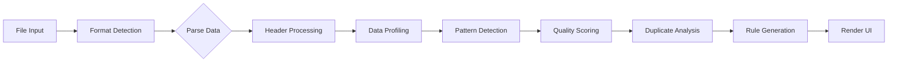

# 📊 DATAPHREAK v8.6.1 - Complete Technical Documentation

## Executive Summary

DATAPHREAK is a revolutionary single-file data analysis tool that provides enterprise-grade data quality assessment, cleaning, visualization, and merge capabilities entirely within a web browser. This 1.33MB HTML file contains 8,818 lines of code delivering professional data analysis without installation, servers, or data uploads.

---

## Table of Contents

1. [Overview & Purpose](#overview--purpose)
2. [Architecture & Technical Stack](#architecture--technical-stack)
3. [Complete Feature List](#complete-feature-list)
4. [Data Processing Engine](#data-processing-engine)
5. [User Interface & Themes](#user-interface--themes)
6. [Algorithms & Intelligence](#algorithms--intelligence)
7. [Visualization System](#visualization-system)
8. [Security & Privacy](#security--privacy)
9. [Performance & Optimization](#performance--optimization)
10. [Version History](#version-history)
11. [API & Extension Points](#api--extension-points)
12. [Development Details](#development-details)

---

## Overview & Purpose

### What is DATAPHREAK?

DATAPHREAK is a **100% client-side** data analysis platform that transforms messy CSV/Excel data into clean, validated, professional datasets in seconds. It combines smart pattern detection, fuzzy duplicate matching, and comprehensive quality scoring in a single HTML file.

### Core Philosophy

- **Privacy First**: No data ever leaves your computer
- **Zero Installation**: Works instantly in any modern browser
- **Professional Power**: Enterprise features without enterprise complexity
- **Universal Access**: Free forever, works offline, no accounts needed

### Target Users

1. **Business Analysts** - Quick data validation without IT tickets
2. **Marketing Teams** - Customer list deduplication and cleaning
3. **Operations** - Data standardization and quality control
4. **Consultants** - Portable analysis tool for client work
5. **Small Businesses** - Professional data tools without the cost

---

## Architecture & Technical Stack

### Single-File Architecture

```
DATAPHREAK.html (1.33MB total)
├── HTML Structure (318 lines)
├── CSS Styles (2,242 lines)
│   ├── Dark Theme (default)
│   ├── Light Theme (golden)
│   └── Matrix Theme (green)
├── JavaScript Core (6,258 lines)
│   ├── State Management
│   ├── Data Processing
│   ├── UI Rendering
│   └── Event Handlers
└── Embedded Libraries
    └── SheetJS (951KB embedded Base64)
```

### Technology Components

| Component | Technology | Purpose |
|-----------|------------|---------|
| **Structure** | HTML5 | Semantic markup, accessibility |
| **Styling** | CSS3 Custom Properties | Dynamic theming, animations |
| **Logic** | ES6+ JavaScript | Async operations, modern APIs |
| **Excel Support** | SheetJS (embedded) | XLSX/XLS parsing |
| **Storage** | LocalStorage API | Preferences, rules |
| **Files** | FileReader/Blob APIs | Import/export |
| **Security** | CSP Headers | XSS protection |

### Browser Requirements

- **Chrome**: 80+ (recommended)
- **Firefox**: 75+
- **Safari**: 13+
- **Edge**: 80+
- **RAM**: 4GB recommended for 1M+ rows

---

## Complete Feature List

### 1. Data Import Capabilities

#### File Format Support
- **CSV** - Comma-separated with smart delimiter detection
- **TSV** - Tab-separated values
- **Excel** - Both .xlsx (modern) and .xls (legacy)

#### Smart Import Features
- **Auto-delimiter Detection**: Analyzes first line for optimal separator (`,` `;` `\t`)
- **Header Deduplication**: Renames duplicate columns (adds `__2`, `__3` suffixes)
- **Empty Row Stripping**: Removes trailing blank rows
- **Chunked Processing**: Large files processed in 50KB chunks
- **Progress Indicators**: Real-time loading progress for files >5MB
- **Drag & Drop**: Direct file dropping onto dropzone
- **Sample Data**: Built-in 400-row dataset for testing

### 2. Data Quality Assessment

#### Comprehensive Scoring System
```javascript
Quality Score = (Completeness × 40%) + (Consistency × 30%) + (Validity × 30%)

Grades:
A: 90-100% - Excellent quality
B: 80-89%  - Good quality  
C: 70-79%  - Fair quality
D: 60-69%  - Poor quality
F: <60%    - Failing quality
```

#### Key Performance Indicators (KPIs)
1. **Total Rows** - Record count
2. **Total Columns** - Field count
3. **Exact Duplicates** - Identical row matches
4. **Missing Values** - Empty cells count & percentage
5. **Data Completeness** - Filled vs empty ratio
6. **Total Data Points** - Rows × Columns
7. **Quality Score** - Comprehensive A-F grade

### 3. Smart Pattern Detection

#### Automatic Pattern Recognition
- **Email Addresses** - RFC-compliant validation
- **Phone Numbers** - International & domestic formats
- **Dates** - ISO 8601, US (MM/DD/YYYY), European (DD/MM/YYYY)
- **URLs** - HTTP/HTTPS web addresses
- **Salesforce IDs** - 15 & 18 character detection
- **Numeric Patterns** - Currency, percentages, scientific notation

#### Confidence Indicators
- 🟢 **Green** - High confidence (>80% match)
- 🟡 **Yellow** - Partial match (50-80%)
- ⚫ **Gray** - Low confidence (<50%)

### 4. Duplicate Detection System

#### Exact Duplicate Matching
- Row-level hash comparison
- Group identification (Group 1, 2, 3...)
- Export with `exact_duplicate_group` column

#### Fuzzy Duplicate Detection
```javascript
// Levenshtein-based similarity
Similarity Thresholds:
- High: >90% similar
- Medium: 75-90% similar  
- Low: 60-75% similar

Features:
- Smart blocking (first char + length)
- Performance cap at 200K comparisons
- Cross-file matching support
```

### 5. Data Cleaning Operations

#### Available Transformations
| Operation | Description | Example |
|-----------|-------------|---------|
| **Trim Spaces** | Remove leading/trailing whitespace | `"  John  "` → `"John"` |
| **Fix Case** | Smart capitalization by field type | `"john SMITH"` → `"John Smith"` |
| **Remove Accents** | Strip diacritical marks | `"José"` → `"Jose"` |
| **Convert SF IDs** | 15→18 character Salesforce IDs | `"001D000000AbcDe"` → `"001D000000AbcDeAAA"` |

#### Quick Actions
- **🧹 Clean All** - Apply all cleaning operations
- **🔍 Analyze Keys** - Find unique identifiers
- **➕ Add ID Column** - Generate surrogate keys
- **📊 Export Summary** - Create data dictionary

### 6. Data Validation Rules

#### Rule Types
- **Regex Patterns** - Custom regular expressions (auto-suggested for email/date columns)
- **Allowed Values** - User-defined enumerated value lists (no auto-population)
- **Required Fields** - Non-null enforcement
- **Range Validation** - Min/max for numbers
- **Cross-field Rules** - Inter-column dependencies

#### Rule Management
- Auto-save by dataset signature
- Import/export rule templates
- Per-column validation with "Run Rules" button
- Invalid row highlighting with issue counts
- Clean UI without redundant columns

### 7. Advanced Data Visualization

#### Histogram Features
- **Smart Binning** - Automatic age groups (5-year ranges)
- **Statistical Overlays** - Mean (μ) and Median (M) lines
- **Interactive Tooltips** - Hover for details
- **Gradient Colors** - Frequency-based coloring
- **Smooth Animations** - Loading transitions
- **Print Support** - Export to PDF

#### Chart Types
1. **Numeric Histograms** - Distribution with statistics
2. **Categorical Bars** - Top 10 values horizontal
3. **Missing Data Heatmap** - Visual gap analysis
4. **Quality Gauges** - KPI visualization

### 8. Cross-File Operations

#### Merge Capabilities
- **Join Types**: Inner, Left, Right, Full Outer
- **Key Matching**: Single or composite keys
- **Fuzzy Matching**: Approximate key matching
- **Conflict Resolution**: Configurable strategies

#### Dataset Management
- Primary/Secondary dataset slots
- Hot-swap between datasets
- Independent processing
- Synchronized visualization

### 9. Undo/Redo System

```javascript
class UndoRedoManager {
  - Maximum 50 operations history
  - Memory-efficient snapshots
  - Automatic cleanup at 80% capacity
  - Command pattern implementation
}
```

### 10. Export Capabilities

#### Export Formats
| Format | Description | Features |
|--------|-------------|----------|
| **CSV** | Comma-separated | Formula injection protection |
| **JSON** | Array of objects | Headers as keys |
| **Data Dictionary** | Field metadata | Statistics, rules, patterns |
| **Duplicate Report** | Enhanced CSV | Group columns added |

---

## Data Processing Engine

### Core Processing Pipeline



### Memory Management

```javascript
// Optimization strategies for large datasets
function optimizeMemoryUsage() {
  if (dataSize > 1000000) {
    // Clear undo history
    undoRedoManager.clearHistory();
    // Release cached DOM
    STATE.cachedElements = null;
    // Force garbage collection
    if (window.gc) window.gc();
  }
}
```

### State Management

```javascript
const STATE = {
  // Core data
  headers: [],
  rows: [],
  profiles: [],
  
  // Datasets
  primaryHeaders: [],
  primaryRows: [],
  secondaryHeaders: [],
  secondaryRows: [],
  activeDataset: 'primary',
  
  // Analysis
  dupes: [],
  fuzzyDuplicates: [],
  headerSig: '',
  
  // Validation
  rules: {
    regex: [],
    allowed: [],
    regexStr: [],
    allowedStr: []
  },
  
  // UI State
  suggestions: {},
  fileInfo: {}
};
```

---

## User Interface & Themes

### Theme System

#### 1. Dark Theme (Default)
```css
- Background: #2a2a2a (medium gray)
- Accent: #22c55e (green), #38bdf8 (blue)
- Secondary: #9333ea (purple)
- Particles: Purple cosmic dust falling effect
- Features: Purple glows, smooth gradients
```

#### 2. Light Theme
```css
- Background: #f9f5ee (cream)
- Border: #b8860b (goldenrod)
- Accent: Golden yellows
- Particles: Golden sparkles rising effect
- Features: 3D button effects, warm glows
```

#### 3. Matrix Theme
```css
- Background: #03140a (near-black green)
- Text: #00ff99 (matrix green)
- Accent: Green monochromes
- Particles: Digital rain characters falling
- Features: Terminal aesthetic, green glows
```

### Particle Systems

```javascript
// Three unique particle effects
1. Light Theme: Golden sparkles (4 per 100ms)
2. Dark Theme: Purple cosmic dust (3 per 200ms)
3. Matrix Theme: Green characters (configurable)

// Performance optimized
- Automatic cleanup after animation
- Theme-aware start/stop
- No memory leaks
```

### Responsive Design

```css
/* Breakpoint Strategy */
Desktop:  >1200px  - Full 2-column grid
Tablet:   768-1200px - Flexible grid  
Mobile:   <768px   - Single column stack

/* Collapsible Panels (lines 8691-8810) */
- Click chevron or entire header to toggle
- Skips interactive elements (buttons, selects)
- Smooth chevron rotation animation
- Max-height transitions for smooth collapse
```

---

## Algorithms & Intelligence

### 1. Data Profiling Algorithm

```javascript
function profileColumn(values) {
  // Type detection with confidence scoring
  const types = { number: 0, date: 0, string: 0 };
  
  for (const value of values) {
    if (!isNaN(Number(value))) types.number++;
    if (isValidDate(value)) types.date++;
    types.string++;
  }
  
  // Determine predominant type (80% threshold)
  const confidence = Math.max(...Object.values(types)) / total;
  
  return {
    type: predominantType,
    confidence: confidence,
    unique: uniqueCount,
    missing: missingCount,
    patterns: detectedPatterns
  };
}
```

### 2. Fuzzy Matching Algorithm

```javascript
// Levenshtein Distance Implementation
function levenshtein(str1, str2) {
  const matrix = [];
  
  // Initialize matrix
  for (let i = 0; i <= str2.length; i++) {
    matrix[i] = [i];
  }
  for (let j = 0; j <= str1.length; j++) {
    matrix[0][j] = j;
  }
  
  // Calculate distances
  for (let i = 1; i <= str2.length; i++) {
    for (let j = 1; j <= str1.length; j++) {
      const cost = str2[i-1] === str1[j-1] ? 0 : 1;
      matrix[i][j] = Math.min(
        matrix[i-1][j-1] + cost,  // substitution
        matrix[i][j-1] + 1,        // insertion
        matrix[i-1][j] + 1         // deletion
      );
    }
  }
  
  return matrix[str2.length][str1.length];
}

// Similarity percentage
function similarity(str1, str2) {
  const distance = levenshtein(str1, str2);
  const maxLength = Math.max(str1.length, str2.length);
  return ((maxLength - distance) / maxLength) * 100;
}
```

### 3. Quality Scoring Algorithm

```javascript
function calculateDataQualityScore(headers, rows) {
  // Completeness (40% weight)
  const completeness = (filledCells / totalCells) * 100;
  
  // Consistency (30% weight)
  const consistency = (consistentColumns / totalColumns) * 100;
  
  // Validity (30% weight)
  const validity = (validCells / checkedCells) * 100;
  
  // Weighted average
  const score = (completeness * 0.4) + 
                (consistency * 0.3) + 
                (validity * 0.3);
  
  // Grade assignment
  const grade = 
    score >= 90 ? 'A' :
    score >= 80 ? 'B' :
    score >= 70 ? 'C' :
    score >= 60 ? 'D' : 'F';
  
  return { score, grade, breakdown };
}
```

### 4. Pattern Detection Intelligence

```javascript
// Simplified Pattern Detection System (lines 4043-4158)
const PATTERN_LIBRARY = {
  email: {
    name: 'Email Address',
    regex: /^[a-zA-Z0-9._%+-]+@[a-zA-Z0-9.-]+\.[a-zA-Z]{2,}$/,
    specificity: 10,
    validate: (value) => {
      const str = String(value).trim().toLowerCase();
      return /@/.test(str) && PATTERN_LIBRARY.email.regex.test(str);
    },
    fix: (value) => String(value).trim().toLowerCase(),
    icon: '📧'
  },
  
  phone: {
    name: 'Phone Number', 
    regex: /^(\+\d{1,4}[\s\-\.]?)?\(?[\d\s\-\(\)\.]{7,18}\)?$/,
    specificity: 8,
    validate: (value) => {
      const cleaned = String(value).replace(/[\s\-\(\)\.]/g, '');
      // Must be 7-15 digits, exclude date patterns
      if (!/^\+?\d{7,15}$/.test(cleaned)) return false;
      if (/^\d{4}[-\/]\d{1,2}[-\/]\d{1,2}$/.test(value)) return false;
      return true;
    },
    icon: '📞'
  },
  
  date: {
    name: 'Date',
    specificity: 9,
    parseInternationalDate: (str) => {
      // ISO format, US format, European format detection
      // Smart heuristics for ambiguous dates (lines 4102-4147)
    },
    icon: '📅'
  }
};

// Pattern detection with column hints (lines 4161-4245)
function detectPatterns(values, columnName) {
  const columnLower = columnName.toLowerCase();
  let patternOrder = Object.keys(PATTERN_LIBRARY);
  
  // Prioritize patterns based on column name
  if (columnLower.includes('email')) {
    patternOrder = ['email', ...patternOrder.filter(p => p !== 'email')];
  } else if (columnLower.includes('phone')) {
    patternOrder = ['phone', ...patternOrder.filter(p => p !== 'phone')];
  } else if (columnLower.includes('date')) {
    patternOrder = ['date', ...patternOrder.filter(p => p !== 'date')];
  }
  
  // Test patterns and return confidence scores
}
```

---

## Visualization System

### Histogram Generation

```javascript
function createHistogram(data, columnName, dataType) {
  const svg = document.createElementNS('http://www.w3.org/2000/svg', 'svg');
  
  // Smart axis titles based on column patterns
  const xTitle = generateSmartAxisTitle(columnName, 'x');
  const yTitle = 'Frequency (Count)';
  
  if (dataType === 'number') {
    // Intelligent binning
    const bins = createSmartBins(data);
    
    // Add statistical overlays
    const mean = calculateMean(data);
    const median = calculateMedian(data);
    
    // Draw with gradients and animations
    drawBars(svg, bins, gradients);
    drawStatisticalLines(svg, mean, median);
  }
  
  return svg;
}
```

### Smart Axis Titles

```javascript
function generateSmartAxisTitle(columnName, axis) {
  const patterns = {
    age: 'Age (Years)',
    price: 'Price ($)',
    salary: 'Salary ($)',
    date: 'Date',
    email: 'Email Domain',
    phone: 'Phone Area Code'
  };
  
  for (const [pattern, title] of Object.entries(patterns)) {
    if (columnName.toLowerCase().includes(pattern)) {
      return title;
    }
  }
  
  return columnName; // Default to column name
}
```

### Interactive Tooltips

```javascript
function showTooltip(event, data) {
  const content = `
    <div>📊 ${data.rangeLabel}</div>
    <div>Count: ${data.count.toLocaleString()}</div>
    <div>Percentage: ${data.percentage}%</div>
    <div>Rank: #${data.rank}</div>
    <div>${data.quality}</div>
  `;
  
  // Smart positioning with boundary detection
  positionTooltip(tooltip, event, boundaries);
}
```

---

## Security & Privacy

### Security Measures

1. **100% Client-Side Processing**
   - No server communication
   - No external API calls
   - No data transmission

2. **Content Security Policy**
```html
<meta http-equiv="Content-Security-Policy" 
      content="default-src 'self'; 
               script-src 'self' 'unsafe-inline'; 
               style-src 'self' 'unsafe-inline'; 
               connect-src 'self';">
```

3. **CSV Injection Prevention**
```javascript
function csvEscape(value) {
  // Prefix dangerous characters
  if (/^[=+\-@]/.test(value)) {
    value = "'" + value;
  }
  
  // Escape quotes and commas
  if (/[",\n]/.test(value)) {
    value = '"' + value.replace(/"/g, '""') + '"';
  }
  
  return value;
}
```

4. **Local Storage Encryption** (Optional)
```javascript
// AES-GCM encryption for stored preferences
if (prefs.encrypt && prefs.password) {
  const encrypted = await encryptData(data, password);
  localStorage.setItem(key, encrypted);
}
```

---

## Performance & Optimization

### Performance Benchmarks

| Dataset Size | Load Time | Analysis | Memory | Fuzzy Match |
|-------------|-----------|----------|--------|-------------|
| 1K rows | <100ms | <200ms | ~5MB | 45ms |
| 10K rows | ~500ms | ~1s | ~25MB | 2.1s |
| 100K rows | ~3s | ~5s | ~150MB | 95s |
| 1M rows | ~20s | ~30s | ~1.2GB | ~20min |

### Optimization Strategies

1. **Chunked Processing**
```javascript
const CHUNK_SIZE = 50000; // Process 50K chars at a time
for (let i = 0; i < data.length; i += CHUNK_SIZE) {
  await processChunk(data.slice(i, i + CHUNK_SIZE));
  updateProgress((i / data.length) * 100);
}
```

2. **Smart Blocking for Fuzzy Matching**
```javascript
// Reduce O(n²) to O(n×m) where m << n
const blocks = groupByFirstCharAndLength(data);
```

3. **Virtual Scrolling** (Tables)
```javascript
// Render only visible rows
const visibleRows = getVisibleRows(scrollTop, rowHeight);
renderRows(visibleRows);
```

4. **Memory Management**
```javascript
// Clear unused references
if (memoryPressure > threshold) {
  undoRedoManager.trimHistory();
  clearCachedDOM();
  if (window.gc) window.gc();
}
```

---

## Version History

### v8.6.1 (Current - January 2025)
- **UI/UX Improvements**
  - Fixed Row Analysis table alignment issues
  - Improved responsive design for all screen sizes
  - Enhanced duplicate section title visibility
  - Removed auto-population of "Allowed set" fields
  - Removed redundant "Expected" column
  - Changed "Run Checks" to "Run Rules" for clarity

### v8.6.0 (January 2025)
- **Professional Visualization Revolution**
  - Smart axis titles based on column patterns
  - Enhanced tooltips with rich insights
  - Data-driven color coding (red for issues, green for clean)
  - Statistical overlays (mean, median)
  - Professional typography and layout

- **Critical Stability Fix**
  - Fixed JavaScript variable collision
  - Restored all button functionality

### v8.5.0
- **True Offline Functionality**
  - Embedded 951KB SheetJS library
  - Zero external dependencies
  - Enhanced CSP security

### v0.8.0
- **UX Revolution**
  - 5-minute getting started guide
  - 100% tooltip coverage
  - Professional help system
  - Custom data analytics favicon

### v0.6.1
- **Data Visualization**
  - Interactive histograms
  - Smooth animations
  - PDF export support

### v0.6.0
- **Theme System Overhaul**
  - Three complete themes
  - Particle effects for each theme
  - Perfect visual parity

---

## API & Extension Points

### Core Functions

```javascript
// File processing
parseCSV(text: string): {headers: string[], rows: any[][]}
parseExcel(buffer: ArrayBuffer): Promise<ParseResult>
smartParseFile(file: File): Promise<ParseResult>

// Data analysis
profileDataset(headers: string[], rows: any[][]): Profile[]
findDuplicates(rows: any[][]): number[][]
findFuzzyDuplicates(rows: any[][], threshold: number): Match[]
calculateDataQualityScore(headers, rows): QualityScore

// Data operations
applyOperations(data: any[][], ops: Operation[]): any[][]
mergeDatasets(primary: Dataset, secondary: Dataset): Dataset

// Export functions
exportToCSV(headers: string[], rows: any[][]): string
exportToJSON(headers: string[], rows: any[][]): string
exportDataDictionary(headers, profiles, rules): string
```

### Custom Events

```javascript
// Listen for processing events
document.addEventListener('dataphreak:loaded', (e) => {
  console.log('Dataset loaded:', e.detail);
});

document.addEventListener('dataphreak:analyzed', (e) => {
  console.log('Analysis complete:', e.detail);
});
```

### Extension Hooks

```javascript
// Add custom validators
DATAPHREAK.validators.custom = {
  name: 'Custom Validator',
  validate: (value) => {
    // Custom logic
    return isValid;
  }
};

// Add custom operations
DATAPHREAK.operations.custom = {
  name: 'Custom Operation',
  transform: (value) => {
    // Custom transformation
    return transformedValue;
  }
};
```

---

## Development Details

### Code Organization

```
JavaScript Structure (6,258 lines):
├── Configuration & Constants (lines 1-100)
├── State Management (lines 101-300)
├── Undo/Redo System (lines 301-610)
├── Helper Functions (lines 611-1000)
├── CSV/Excel Parsing (lines 1001-1500)
├── Data Profiling (lines 1501-2000)
├── Pattern Detection (lines 2001-2500)
├── Duplicate Detection (lines 2501-3000)
├── Fuzzy Matching (lines 3001-3500)
├── Data Operations (lines 3501-4000)
├── Validation Rules (lines 4001-4500)
├── UI Rendering (lines 4501-5500)
├── Histogram Generation (lines 5501-6500)
├── Theme & Particles (lines 6501-7000)
├── Event Handlers (lines 7001-8000)
└── Initialization (lines 8001-8818)
```

### Debug Mode

```javascript
// Enable debug logging
window.DATAPHREAK_DEBUG = true;

// Debug functions available
debugLog(category, message, data)
debugError(category, error, context)

// Performance monitoring
console.time('operation');
// ... code ...
console.timeEnd('operation');
```

### Build Information

```yaml
File: DATAPHREAK.html
Size: 1.33MB (1,396,736 bytes)
Lines: 8,818 total
  - HTML: 318 lines
  - CSS: 2,242 lines
  - JavaScript: 6,258 lines
Version: 8.6.1
Last Updated: January 2025
Author: Zachary Sluss
License: Open Source (Beta)
```

---

## Future Roadmap

### Version 9.0 (Planned)
- Web Worker support for parallel processing
- Advanced statistics (regression, clustering)
- API data source integration
- Custom formula builder
- Real-time collaboration

### Version 10.0 (Vision)
- Machine learning anomaly detection
- Natural language queries
- Plugin architecture
- Mobile app versions
- Enterprise features

---

## Support & Contact

- **GitHub**: https://github.com/Zacsluss/DATAPHREAK
- **Live Demo**: https://zacsluss.github.io/DATAPHREAK/DATAPHREAK.html
- **Email**: zacsluss@yahoo.com
- **Documentation**: This file

---

## Conclusion

DATAPHREAK proves that professional data analysis doesn't require complex installations, expensive licenses, or privacy compromises. This single HTML file delivers enterprise-grade capabilities while respecting user privacy and providing an exceptional user experience.

The tool's architecture balances sophistication with simplicity, providing powerful features through an intuitive interface. With its comprehensive feature set, robust security, and zero-installation requirement, DATAPHREAK democratizes data analysis for everyone.

---

**🚀 DATAPHREAK v8.6.1 - Professional Data Analysis That Just Works**

*"From messy data to professional insights in 30 seconds"*

---

*Document Generated: January 2025*  
*Tool Version: 8.6.0*  
*File Size: 1.33MB*  
*Total Code: 8,818 lines*  
*100% Client-Side | 100% Private | 100% Free*