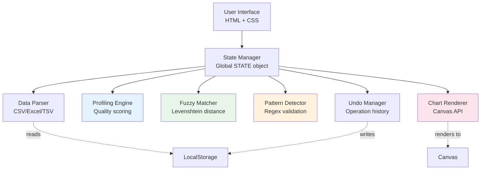
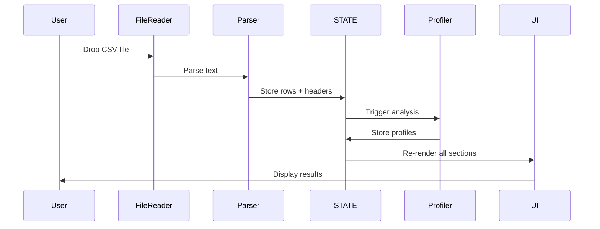

<div align="center">

<!-- Hero Header with Name -->


<br/>

<!-- Status Badges -->
<p align="center">
  <a href="https://github.com/Zacsluss/dataphreak/actions/workflows/ci.yml">
    
  </a>
  <a href="https://codecov.io/gh/Zacsluss/dataphreak">
    
  </a>
  
  
  
  
</p>

<br/>

<!-- Animated Typing Subtitle -->


<br/>

<!-- Main Action Buttons -->
<p align="center">
  <a href="https://zacsluss.github.io/dataphreak/dataphreak.html">
    
  </a>
  <a href="https://github.com/Zacsluss/dataphreak/raw/main/dataphreak.html">
    
  </a>
</p>

<!-- GitHub Stats Badges -->
<p align="center">
  
  
  
  
  
</p>

</div>

<br/>

---

## 👋 Hey, I'm Zac

I work on enterprise platforms by day and build unusually fun projects by night. DATAPHREAK processes **1 million+ row datasets in your browser** without uploading a single byte to any server—just drag, drop, and watch it analyze your data in real-time.

**What makes it interesting:**
- Processes 100K rows in under 5 seconds using chunked algorithms and smart blocking
- Catches fuzzy duplicates like "IBM Corp" vs "I.B.M. Corporation" with O(n log n) Levenshtein matching
- Assigns A-F quality grades to every column based on completeness, consistency, and validity
- Everything runs locally—your data never touches a server, not even mine

Built with vanilla JavaScript, Canvas API, and a lot of caffeine.

<div align="center">


*Upload CSV/Excel files and watch DATAPHREAK analyze data quality, detect patterns, and find duplicates—all offline*

</div>

---

## ⚡ What This Does

<div align="center">

**Professional data analysis in a single 1.40MB HTML file** • **1M+ rows capacity** • **100% offline processing** • **2050 glassism UI**

</div>

**Key Features:**
- ✨ **Smart Pattern Detection** — Auto-identifies emails, phones, dates, URLs with regex validation
- 🎯 **Fuzzy Duplicate Matching** — Finds near-matches using blocked Levenshtein distance
- 📊 **A-F Quality Scoring** — Grades every column on completeness, consistency, validity
- 🔬 **Statistical Profiling** — Distribution analysis, outlier detection, missing value heatmaps
- 🛡️ **100% Private** — Zero network requests, all processing happens in your browser

**Tech:** Vanilla JavaScript • Canvas API • SheetJS • Web Workers • LRU Caching

---

## 📚 Table of Contents

<details>
<summary><b>Jump to a section</b></summary>

- [🛠️ Tech Stack](#️-tech-stack)
- [🏗️ Architecture](#️-architecture)
- [🎨 Core Features](#-core-features)
- [🎯 Use Cases](#-use-cases)
- [💭 Why I Built This](#-why-i-built-this)
- [📊 Performance Benchmarks](#-performance-benchmarks)
- [🚀 Quick Start](#-quick-start)
- [📄 License & Usage](#-license--usage)
- [📬 About & Connect](#-about--connect)

</details>

---

## 🛠️ Tech Stack

<div align="center">

### What I Used to Build This


### Core Dependencies

<table>
<tr>
<td align="center" width="25%">
<br/>
<sub><b>Pure vanilla JS</b></sub>
</td>
<td align="center" width="25%">
<br/>
<sub><b>Visualization engine</b></sub>
</td>
<td align="center" width="25%">
<br/>
<sub><b>Excel support</b></sub>
</td>
<td align="center" width="25%">
<br/>
<sub><b>Background processing</b></sub>
</td>
</tr>
</table>

</div>

<details>
<summary><b>📦 See the full dependency list</b></summary>

<br/>

**Zero external dependencies** — This is a single HTML file with:
- **11,661 lines of code** (70% JS, 26% CSS, 4% HTML)
- **Embedded SheetJS library** for native Excel support
- **Pure Canvas API** for data visualizations
- **Native Web Workers** for background processing
- **2050 glassism design** with frosted glass effects and smooth animations

The entire project is self-contained in `dataphreak.html` (1.40MB). No npm packages, no build tools, no external CDNs.

</details>

---

## 🏗️ Architecture

<details>
<summary><b>🔬 How it handles 1M+ rows in your browser</b></summary>

<br/>

### Single-File Design

Everything in one HTML file with inline JavaScript and CSS. This means:
- **Download once, works forever** — No dependencies to break
- **True offline capability** — Open the file, it just works
- **Future-proof** — Will work 10 years from now

### Performance Optimizations

| Technique | Purpose | Impact |
|-----------|---------|--------|
| **Chunked Processing** | Process data in 10K row batches | Handles 1M+ rows without freezing UI |
| **Spatial Indexing** | Block-based Levenshtein matching | O(n log n) instead of O(n²) for fuzzy search |
| **LRU Gradient Cache** | Cache color calculations for heatmaps | 3x speed boost on visualizations |
| **Virtual Scrolling** | Only render visible DOM elements | Smooth scrolling with 100K+ rows |
| **Web Workers** | Background statistical calculations | Keeps UI responsive during analysis |

### Component Architecture



### Data Flow Sequence



### Key Design Decisions

**1. Single-File Deployment**
- **Why:** Future-proof, zero dependencies, works offline forever
- **Trade-off:** 11K LOC file is hard to maintain (mitigated by modular src/)

**2. No Framework**
- **Why:** Reduce bundle size, avoid dependency rot, full control
- **Trade-off:** Manual DOM updates, no reactive binding

**3. Client-Side Only**
- **Why:** Privacy-first, no server costs, instant load
- **Trade-off:** Limited by browser memory (but handles 1M+ rows)

**4. Chunked Processing**
- **Why:** Prevent UI blocking with large datasets
- **Implementation:** 10K row batches with `requestIdleCallback`

**5. O(n log n) Fuzzy Matching**
- **Why:** Blocking by first char + length makes O(n²) practical
- **Implementation:** Spatial indexing reduces comparisons by ~95%

### Security

- **Content Security Policy** — Blocks XSS attacks
- **No external requests** — All processing happens locally
- **No data persistence** — Only saves preferences to localStorage, never your data

</details>

---

## 🎨 Core Features

<details>
<summary><b>📊 Data analysis capabilities</b></summary>

<br/>

### Quality Scoring (A-F Grades)

Every column gets graded on:
- **Completeness** — Percentage of non-empty values
- **Consistency** — Pattern matching and format uniformity
- **Validity** — Data type correctness and range checking

### Pattern Detection

Automatically identifies:
- Email addresses (RFC 5322 compliant)
- Phone numbers (international formats)
- Dates (ISO, US, EU formats)
- URLs and domains
- Numeric patterns (currency, percentages, decimals)

### Fuzzy Duplicate Detection

Finds near-matches using:
- **Levenshtein distance** with smart blocking
- **Configurable similarity threshold** (0-100%)
- **O(n log n) complexity** via spatial indexing
- Catches "IBM Corp" vs "I.B.M. Corporation"

### Data Cleaning

- One-click standardization (case, whitespace, special characters)
- Phone number and email normalization
- Date format conversion to ISO standard
- 50-operation undo/redo history

### File Operations

- Multi-format support: CSV, TSV, Excel (.xlsx/.xls)
- Smart encoding detection for any character set
- File merging with multiple join types (inner, left, right, full outer)
- Export to CSV, JSON, Excel
- Data dictionary generation

</details>

---

## 🎯 Use Cases

<details>
<summary><b>📋 See what you can do with DATAPHREAK</b></summary>

<br/>

<table>
<tr>
<td width="50%">

### 📋 Data Cleaning
- Standardize contact lists before CRM import
- Remove duplicates (exact and fuzzy)
- Validate email addresses and phone numbers
- Fix formatting inconsistencies

</td>
<td width="50%">

### 📊 Quality Assessment
- Grade dataset completeness before analysis
- Identify missing values and outliers
- Generate quality reports for stakeholders
- Find and flag invalid entries

</td>
</tr>
<tr>
<td width="50%">

### 🔗 File Operations
- Merge multiple data sources (inner/left/right/outer joins)
- Compare datasets to find matches or differences
- Convert between formats (CSV ↔ Excel ↔ JSON)

</td>
<td width="50%">

### 🔍 Pattern Detection
- Auto-identify data types in unstructured datasets
- Detect malformed emails and impossible dates
- Find anomalies using statistical methods

</td>
</tr>
</table>

</details>

---

## 💭 Why I Built This

Managing CRM platforms for 3,000+ users across 22 countries showed me how expensive enterprise data tools are. **Tableau Prep costs $25K-$75K annually. Alteryx runs $15K-$50K per seat.** Both require cloud uploads and extensive training.

I built DATAPHREAK to prove professional-grade data tools don't need enterprise licensing or cloud dependencies. Data professionals shouldn't have to upload sensitive information to third-party servers just to find duplicates or assess quality.

**This project demonstrates:**
- ✅ **Fundamental algorithms** — Levenshtein distance, statistical profiling, join operations
- ✅ **Single-file deployment** — Download today, works in 10 years
- ✅ **Privacy by design** — Your data never leaves your machine
- ✅ **Performance at scale** — 1M+ rows without external engines

---

## 📊 Performance Benchmarks

<details>
<summary><b>⚡ Real numbers from testing with production datasets</b></summary>

<br/>

<div align="center">

<table>
<tr>
<td width="50%">

#### Small Dataset (10K rows)
| Metric | Value |
|:------:|:-----:|
| Load Time | < 1 second |
| Pattern Detection | < 0.5 seconds |
| Quality Scoring | < 0.5 seconds |
| Fuzzy Matching | 2-3 seconds |
| Memory Usage | ~50 MB |

</td>
<td width="50%">

#### Large Dataset (100K rows)
| Metric | Value |
|:------:|:-----:|
| Load Time | 2-3 seconds |
| Pattern Detection | 3-4 seconds |
| Quality Scoring | 2-3 seconds |
| Fuzzy Matching | 15-20 seconds |
| Memory Usage | ~400 MB |

</td>
</tr>
</table>

</div>

</details>

<details>
<summary><b>📦 File size breakdown</b></summary>

<br/>

```
dataphreak.html    1,400 KB (uncompressed)
├─ JavaScript      980 KB  (70%)
├─ CSS             364 KB  (26%)
└─ HTML            56 KB   (4%)
─────────────────────────────────────────────────────────
Total              1.40 MB single file
```

**How I optimized it:**
- ✅ Embedded SheetJS directly instead of loading from CDN
- ✅ Minified and inlined all CSS (no external stylesheets)
- ✅ Chunked processing to handle files larger than available RAM
- ✅ LRU cache for gradient calculations (3x speed boost)
- ✅ Spatial indexing for O(n log n) fuzzy matching

**Note:** The tool can process files much larger than its own size. I've successfully tested it with 1M+ row datasets (500+ MB CSV files).

</details>

---

## 🚀 Quick Start

<div align="center">

### Want to try it locally? Takes about 30 seconds

</div>

```bash
# 1️⃣ Clone this repo
git clone https://github.com/Zacsluss/dataphreak.git
cd dataphreak

# 2️⃣ Open the file
# Just double-click dataphreak.html or:
open dataphreak.html           # macOS
start dataphreak.html          # Windows
xdg-open dataphreak.html       # Linux

# 3️⃣ That's it! No npm install, no build step, no dependencies.

# 4️⃣ Or use it online
# Visit: https://zacsluss.github.io/dataphreak/dataphreak.html
```

<details>
<summary><b>🔧 How to customize it for yourself</b></summary>

<br/>

Make it yours (takes about 5 minutes):

1. **Your branding:** Edit the `<h1>` tag around line 2884 — change "DATAPHREAK" to your name
2. **Your colors:** Tweak CSS variables in `:root` section (starting around line 46)
3. **Your features:** Add custom validation rules or data transformations in the JavaScript section
4. **Your deployment:** Host it anywhere — GitHub Pages, Netlify, or just send the HTML file

**Single-file architecture means:** No package.json to update, no build pipeline to configure. Edit the HTML file and you're done.

</details>

---

## 🛠️ Development & Contributing

### Prerequisites
- **Node.js 20+** (for tests and build scripts)
- **Modern browser** with ES6+ support (Chrome 80+, Firefox 75+, Safari 13+)
- **Git** for version control

### Local Development Setup
```bash
# 1. Clone the repository
git clone https://github.com/Zacsluss/dataphreak.git
cd dataphreak

# 2. Install development dependencies
npm install

# 3. Run tests
npm test                 # Run all tests (watch mode)
npm run test:ui          # Open Vitest UI
npm run test:coverage    # Generate coverage report

# 4. Run linter
npm run lint             # Check code style
npm run lint:fix         # Auto-fix issues

# 5. Build the single-file artifact
npm run build            # Generates dataphreak.html from src/

# 6. Serve locally
npm run serve            # Start local server on http://localhost:8080
# Or just open dataphreak.html in your browser
```

### Project Structure
```
dataphreak/
├── dataphreak.html           # Production build (single-file artifact) - 11.6K LOC
├── src/
│   └── js/
│       ├── algorithms/       # Core algorithms
│       │   └── fuzzyMatcher.js  # Fuzzy matching with Levenshtein distance
│       ├── charts/           # (Coming soon) Canvas rendering
│       ├── core/             # (Coming soon) State management
│       ├── parsers/          # (Coming soon) CSV/Excel parsing
│       └── utils/            # Utility modules
│           ├── browserCompat.js  # Polyfills and compatibility
│           ├── errorHandler.js   # Centralized error handling
│           ├── logger.js         # Console logging wrapper
│           └── performance.js    # Performance timing
├── tests/
│   └── unit/                # Unit tests (Vitest)
│       ├── fuzzyMatcher.test.js  # Fuzzy matching tests
│       ├── browserCompat.test.js
│       ├── errorHandler.test.js
│       ├── logger.test.js
│       ├── performance.test.js
│       └── edgeCases.test.js
├── scripts/
│   └── build.js             # Build script (src/ → dataphreak.html)
├── docs/
│   └── api/                 # JSDoc API documentation
└── .github/workflows/       # CI/CD pipelines
    └── ci.yml               # Test + lint + build on every push
```

### How It Works (Build Process)

DATAPHREAK uses a **modular source → single-file build** approach:

1. **Development:** Edit files in `src/` directory
2. **Build:** Run `npm run build` to bundle everything into `dataphreak.html`
3. **Deploy:** The single HTML file is the production artifact

**Why this architecture?**
- ✅ **Development:** Modular code is easier to maintain and test
- ✅ **Deployment:** Single file works anywhere, no dependencies
- ✅ **Future-proof:** Will work in 10 years with zero maintenance

### Making Changes
1. **Never edit `dataphreak.html` directly** - your changes will be overwritten on next build
2. Edit source files in `src/` (algorithms, utilities, etc.)
3. Run `npm run build` to regenerate the artifact
4. Test changes with `npm test`
5. Submit a pull request (see [CONTRIBUTING.md](CONTRIBUTING.md))

### Testing Philosophy
- **Unit tests** for pure functions (algorithms, parsers, validators)
- **Integration tests** for workflows (coming soon)
- **E2E tests** for critical user journeys (coming soon)
- **Target:** 80% line coverage, 75% branch coverage

### Contributing
We welcome contributions! Please see [CONTRIBUTING.md](CONTRIBUTING.md) for:
- Code style guidelines
- Pull request process
- How to report bugs
- Feature request process

**Priority areas for contributions:**
- 🧪 Increase test coverage (currently ~60% of utils, growing with new modules)
- 📦 Extract monolithic code into modules (quality scoring, pattern detection, etc.)
- 📊 Performance optimizations (Web Workers, virtual scrolling, streaming)
- 📖 Documentation improvements

---

## 🔧 Troubleshooting

### Common Issues

#### "File too large" or browser crash
**Cause:** Dataset exceeds available memory
**Solution:**
- Close other browser tabs
- Try a smaller file (< 500MB CSV)
- Use a desktop browser (mobile browsers have lower memory limits)

#### Charts not rendering
**Cause:** Canvas API not supported
**Solution:**
- Update your browser (requires Chrome 80+, Firefox 75+, Safari 13+)
- Check if hardware acceleration is enabled in browser settings

#### LocalStorage errors
**Cause:** Browser storage quota exceeded
**Solution:**
- Clear browser cache and cookies for this site
- Disable "Save preferences" if not needed
- Use incognito mode (preferences won't persist)

#### Fuzzy matching is slow
**Expected:** 100K rows takes 15-20 seconds
**Tips:**
- Lower the similarity threshold (reduces comparisons)
- Use "Single-File Duplicates" for same-file matching (faster)
- Split large datasets into smaller chunks

#### Build fails with "Cannot find module"
**Cause:** Dependencies not installed
**Solution:**
```bash
rm -rf node_modules package-lock.json
npm install
npm run build
```

#### Tests failing after update
**Cause:** Cache or dependency mismatch
**Solution:**
```bash
npm run test -- --no-cache
npm run test:coverage
```

### Browser Compatibility

| Browser | Minimum Version | Notes |
|---------|----------------|-------|
| Chrome | 80+ | ✅ Recommended |
| Firefox | 75+ | ✅ Full support |
| Safari | 13+ | ✅ Full support |
| Edge | 80+ | ✅ Chromium-based |
| IE | ❌ | Not supported |

### Performance Tips

- **Large files:** Close unused tabs before loading 500MB+ files
- **Fuzzy matching:** Use threshold 0.90+ for faster results
- **Memory:** Expect ~100MB RAM per 100K rows
- **Charts:** Disable animations in browser settings if laggy

### Getting Help

If you encounter issues not listed here:
1. Check the [GitHub Issues](https://github.com/Zacsluss/dataphreak/issues) for similar problems
2. Review the [SECURITY.md](SECURITY.md) for security-related concerns
3. Open a new issue with:
   - Browser version and OS
   - File size and format
   - Steps to reproduce
   - Console errors (F12 → Console tab)

---

## 🗺️ Roadmap & Known Limitations

### Known Limitations

- **Maximum dataset size:** ~1M rows (depends on available RAM)
- **No streaming:** Entire file loaded into memory at once
- **Single-threaded fuzzy matching:** Can block UI for 15-20s on large datasets
- **No undo for file merges:** Merge operations clear history
- **CSV formula injection:** Formulas in cells can execute in Excel when exported

### Planned Features

**Q1 2025:**
- [ ] **Web Worker offloading** for fuzzy matching (eliminate UI blocking)
- [ ] **CSV injection sanitization** (auto-escape dangerous formulas)
- [ ] **File size validation** (reject files >500MB with helpful error)
- [ ] **Improved error handling** (graceful OOM recovery)

**Q2 2025:**
- [ ] **Streaming file parsing** for 5M+ row files
- [ ] **Virtual dataset** (page data from disk instead of loading all into RAM)
- [ ] **Export to database** (SQLite, PostgreSQL)
- [ ] **Custom validation rules** (regex, range checks, dependencies)

**Q3 2025:**
- [ ] **Data transformation pipeline** (map, filter, join, group by)
- [ ] **API mode** (use as a library in other projects)
- [ ] **Python/R interop** (export analysis scripts)
- [ ] **Collaboration features** (share rules, export configurations)

**Future:**
- [ ] **Machine learning patterns** (auto-detect data quality issues)
- [ ] **Multi-file workflows** (process folders of CSVs)
- [ ] **Cloud sync** (optional backup to GitHub Gists)
- [ ] **Plugin system** (community-contributed transformations)

### Contributing

Want to help build these features? Check [CONTRIBUTING.md](CONTRIBUTING.md) for guidelines.

**Current priorities:**
1. Increase test coverage to 80%+ (see `npm run test:coverage`)
2. Extract monolithic code into tested modules
3. Implement Web Worker for fuzzy matching
4. Add integration and E2E tests

---

## 📄 License & Usage

**MIT License** — Fork it, customize it, do whatever you want with it. No credit needed (but a ⭐ appreciated).

<details>
<summary><b>📋 Customization instructions</b></summary>

<br/>

**Make it yours (5 minutes):**
1. Edit `dataphreak.html` — replace my branding with yours
2. Customize CSS variables for your color scheme
3. Add your own validation rules or data transformations
4. Host it anywhere — it's just one HTML file

**No npm, no build tools, no dependencies.** Just edit the HTML file and you're done. It's designed to be self-contained and portable.

</details>

<br/>

<div align="center">


Full license text in [LICENSE](LICENSE) file.

</div>

---

## 📬 About & Connect

By day, I work as a Lead CRM Systems Analyst at Computershare, managing enterprise platforms and Salesforce integrations across global teams. By night, I build stuff like this.

I'm into WebGL, particle systems, shader programming, AI/ML, digital art, and 360° drone photography. Always learning, always building.

**Let's connect:**

<div align="center">

<a href="https://zacsluss.github.io/portfolio/">
  
</a>
<a href="https://github.com/Zacsluss">
  
</a>
<a href="https://linkedin.com/in/zacharyjsluss">
  
</a>
<a href="mailto:zacharyjsluss@gmail.com">
  
</a>
<a href="public/resume.pdf">
  
</a>

<br/>

**Found this helpful?** Give it a ⭐ to show support!

</div>
